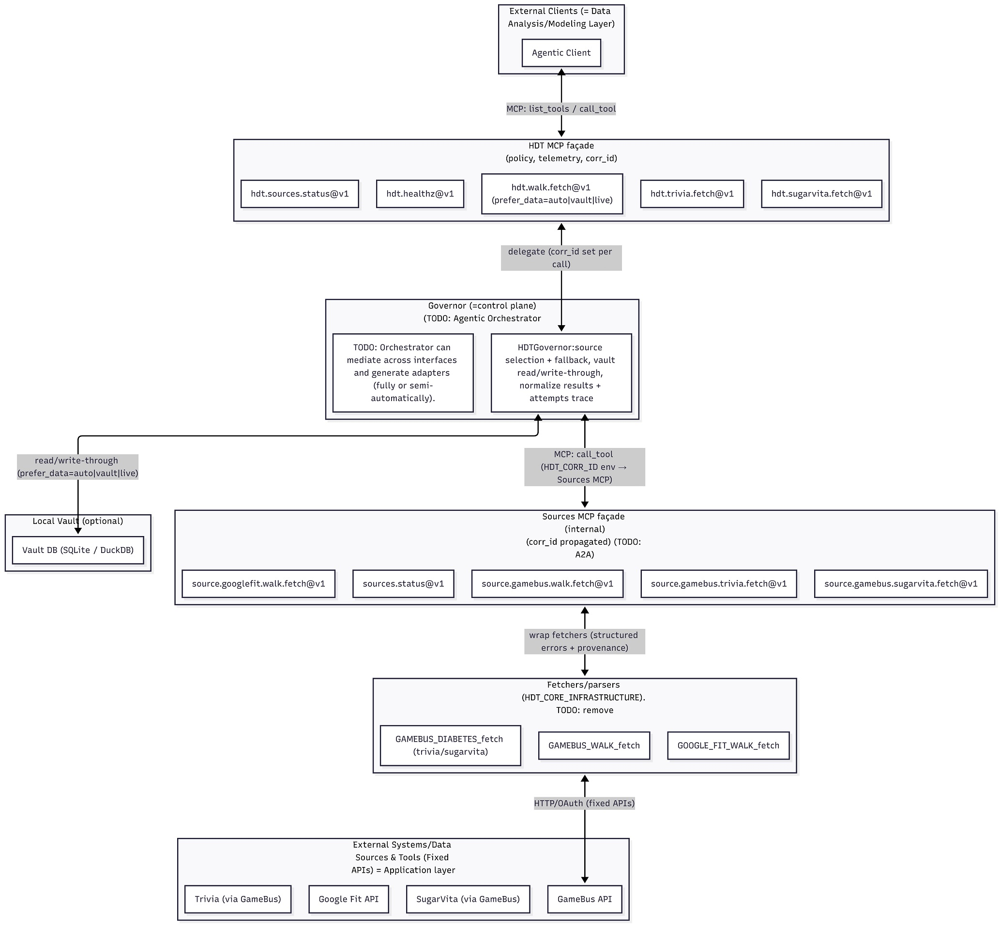

# v0.5.0 — IEEE Software Prototype Milestone (2025-12-12)

## Highlights

* **MCP-only architecture (Option D)**: the HDT is exposed exclusively via MCP tools; REST/OpenAPI is no longer a required integration surface.
* **HDT Governor (orchestrator)**:

  * Central decision point for source selection, fallback, and error normalization.
  * Executes deterministic tool calls; returns structured results with provenance.
* **Sources MCP façade (internal)**:

  * External systems are wrapped as MCP tools (e.g., GameBus, Google Fit, SugarVita, Trivia) using the existing deterministic fetchers/parsers.
  * Enables capability discovery and uniform invocation via MCP rather than bespoke per-client glue.
* **Domain-first tool surface (external)**:

  * HDT-level tools expose capabilities (e.g., walking, diabetes/trivia) without leaking source-specific API details.
* **Structured errors and observability**:

  * All source failures are returned as typed error envelopes (e.g., `not_connected`, `missing_token`, `upstream_error`, `all_sources_failed`) instead of silent empty results.
  * Basic provenance included in tool responses to support debugging and auditing.

## Architecture Overview

* **External interface**: `HDT_MCP.server_option_d` (HDT MCP server)

  * Exposes HDT-level tools to external agents/clients.
  * Delegates execution to the **HDT Governor**.
* **Internal source interface**: `HDT_SOURCES_MCP.server` (Sources MCP server)

  * Exposes source-specific tools (GameBus/Google Fit/SugarVita/Trivia).
  * Reads connection configuration via merged `config/users.json` + `config/users.secrets.json`.
* **Deterministic connectors**: existing fetchers/parsers under `HDT_CORE_INFRASTRUCTURE/`

## Architecture at a glance:


## Quickstart (Windows / PowerShell)

### 1) Configure users and secrets

* Edit `config/users.json` and `config/users.secrets.json`.
* Ensure identity fields match between public and secrets entries:

  * `connected_application` + `player_id` must match for secrets overlay to merge.

### 2) Test Sources MCP (internal)

```powershell
python scripts\test_sources_mcp.py
```

### 3) Test the Governor (selection + fallback)

```powershell
python tests\test_governor.py
```

### 4) Test external HDT MCP (Option D)

```powershell
python scripts\test_hdt_mcp_option_d.py
```

## Breaking Changes

* **REST/OpenAPI are no longer the primary integration contract**. The primary interface is now MCP tools.
* **Tool-first contracts**: clients and integrations should target MCP tool schemas and versioned tool names.
* **Error semantics changed**: failures are expressed as typed error envelopes (not empty lists).

## Known Issues

* Upstream connectivity depends on valid per-source credentials; placeholder tokens will produce `upstream_error`.
* The Governor’s negotiation policy is currently minimal (prefer one source, fallback to another). More advanced selection (quality ranking, latency/cost signals, purpose-aware minimization) is planned.
* Some legacy domain/tools may still exist from the REST-bridged MCP approach; they are being phased out in favor of Option D (`server_option_d.py`).

## Upgrade Notes

* Validate `config/users.json` and `config/users.secrets.json` for consistent `connected_application`/`player_id` pairs; otherwise secrets will not merge.
* If you previously relied on REST endpoints (Flask/OpenAPI), migrate consumers to MCP tools exposed by `HDT_MCP.server_option_d`.
* Keep the Sources MCP server internal (stdio transport) and avoid exposing it directly to untrusted networks.
