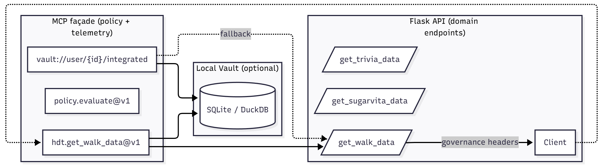

# HDT-Agentic-Interop

Façade and developer API for an **agentic Human Digital Twin (HDT)** stack:

- **Flask API** exposing domain data (walk, SugarVita, trivia) with governance headers.
- **MCP façade** adding policy redaction, telemetry, and a read-mostly **integrated view**.
- Optional local **vault** (SQLite/DuckDB-ready) for caching records.

[](http://localhost:5000/docs)
[](./openapi.yaml)


## Prerequisites

- **Python 3.14 (3.14.x)**
- **Git**
- (Optional) `curl` (Bash) or `Invoke-RestMethod` (PowerShell)

---

## 1) Clone & create a virtualenv

**Bash**
```bash
git clone https://github.com/<your-gh-user>/HDT-agentic-interop.git
cd HDT-agentic-interop
python -m venv .venv
source .venv/bin/activate
```

**PowerShell**
```
git clone https://github.com/<your-gh-user>/HDT-agentic-interop.git
cd HDT-agentic-interop
python -m venv .venv
.\.venv\Scripts\Activate.ps1
```

> Note: The repository includes a `.python-version` file pinned to `3.14` and a `pyproject.toml` with `requires-python = ">=3.14,<3.15"` to ensure the correct interpreter is used.

## 2) Install dependencies
```
pip install -r requirements.txt
# optional (tests, hooks, lint):
pip install -r requirements-dev.txt
```

## 3) Create `.env` (from example)
```
cp .env.example .env
# edit values as needed
```

### Common variables:
```
# Client & API
MODEL_DEVELOPER_1_API_KEY=MODEL_DEVELOPER_1
MCP_CLIENT_ID=MODEL_DEVELOPER_1

# Flask API base (where MCP reads from)
HDT_API_BASE=http://localhost:5000

# Demo flags
HDT_ALLOW_PLACEHOLDER_MOCKS=1
HDT_ENABLE_POLICY_TOOLS=1

# Vault (optional cache)
HDT_VAULT_ENABLE=1
HDT_VAULT_PATH=./data/lifepod.sqlite     # preferred; HDT_VAULT_DB is deprecated

# Policy file location
HDT_POLICY_PATH=./config/policy.json

```

## 4) Seed minimal config (one-time)
Creates tiny defaults so a clean clone works immediately.
```
python scripts/init_sample_config.py
```

It writes:
`config/users.json` – test users (incl. one “Placeholder Walk” source).
`config/user_permissions.json` – grants MODEL_DEVELOPER_1 the needed rights.
`config/external_parties.json` – registers MODEL_DEVELOPER_1 + API key.
`config/policy.json` – permissive analytics lane (allow + no redaction).

Prefer running the script. If you’d rather create files manually, see Appendix: Sample config below.

## Quick end-to-end demo (two terminals)

If you just want to see everything work end-to-end with one demo script:

In one terminal: start the API (localhost:5000)
```
python -m HDT_CORE_INFRASTRUCTURE.HDT_API
```

In another terminal: run the end-to-end demo
```
python scripts/demo_end_to_end.py
```

The demo will:
- Fetch walk data from the API (showing ETag/304 behavior),
- Call MCP tools in-process, and
- Print the last few telemetry lines (policy/redactions) if enabled.

## 5) Run the API (terminal #1)
```
python HDT_CORE_INFRASTRUCTURE/HDT_API.py
```
You should see:
```
Starting the HDT API server on http://localhost:5000
```
## 6) Smoke the API

Note on auth headers:
- Canonical client header is `Authorization: Bearer <API_KEY>`.
- `X-API-KEY: <API_KEY>` is still accepted by the server for compatibility/migration and may be removed later.

### PowerShell
```
$apiKey = $env:MODEL_DEVELOPER_1_API_KEY
if (-not $apiKey) { $apiKey = "MODEL_DEVELOPER_1" }  # local fallback
$headers = @{ Authorization = "Bearer $apiKey"; "X-API-KEY" = $apiKey }  # both work; Authorization is preferred

Invoke-RestMethod -Uri "http://localhost:5000/healthz" -Headers $headers -Method GET
Invoke-RestMethod -Uri "http://localhost:5000/get_walk_data?user_id=2" -Headers $headers -Method GET
```

### Bash
```
APIKEY="${MODEL_DEVELOPER_1_API_KEY:-MODEL_DEVELOPER_1}"
# Prefer Authorization; X-API-KEY also accepted
curl -sf "http://localhost:5000/healthz" -H "Authorization: Bearer $APIKEY"
curl -sf "http://localhost:5000/get_walk_data?user_id=2" \
  -H "Authorization: Bearer $APIKEY" -H "X-API-KEY: $APIKEY"
```

If `HDT_ALLOW_PLACEHOLDER_MOCKS=1, user_id=2` returns a small list of fake step counts.
Responses include governance headers:
```
X-Client-Id: MODEL_DEVELOPER_1
X-Users-Count: 1
X-Policy: passthrough|info|error
```
## 7) Run the MCP façade (terminal #2)
```
python -m HDT_MCP.server
```
Exposes MCP tools/resources (e.g., `hdt.get_walk_data@v1`, `policy.evaluate@v1`).
`vault://user/{id}/integrated` returns the integrated HDT view (reads from vault first, falls back to live, applies policy).
Telemetry is appended to `HDT_MCP/telemetry/mcp-telemetry.jsonl`.

Optional single-file smoke:
```
python scripts/smoke_mcp.py
```
## 8) Tests & pre-commit (optional)
```
pytest -q
pre-commit install
pre-commit run -a
```

If your system default Python is older, ensure `language_version: python3.11` in `.pre-commit-config.yaml`.

## Architecture at a glance:


Governance headers are attached at the API boundary.
Policy (`config/policy.json`) can allow/deny and redact paths (e.g., `"user.email"`).
Vault is a read-mostly cache; integrated view reads from vault first, then falls back to the API.
Walk records are returned in `HDT_WALK_ORDER` (env; default `asc`, i.e., oldest→newest).

## Troubleshooting

- No module named 'HDT_MCP':
Run from repo root and use module invocation: `python -m HDT_MCP.server`.
- 401/403 or empty results:
`.env` must define `MODEL_DEVELOPER_1_API_KEY`; configs in `config/*.json` must match your client id and permissions (the init script sets this).
- Want data without real integrations?
Set `HDT_ALLOW_PLACEHOLDER_MOCKS=1` and use `user_id=2` (Placeholder Walk).
- Vault file not created:
Ensure `HDT_VAULT_ENABLE=1` and `HDT_VAULT_PATH` points to a writable location. Parent directories are created automatically.

Note: `HDT_VAULT_DB` is deprecated and will be removed in a future release. Use `HDT_VAULT_PATH` instead.
- CORS / JS apps:
The API exposes `Access-Control-Expose-Headers: X-Client-Id, X-Users-Count, X-Policy`. If calling from a browser, ensure your `Origin` is acceptable (dev defaults are permissive).

## Appendix: Sample config (what the init script writes)
`config/users.json`
```
{
  "users": [
    {
      "user_id": 1,
      "connected_apps_walk_data": [
        { "connected_application": "GameBus", "player_id": "1" }
      ]
    },
    {
      "user_id": 2,
      "connected_apps_walk_data": [
        { "connected_application": "Placeholder Walk", "player_id": "demo-1" }
      ]
    },
    {
      "user_id": 3,
      "connected_apps_walk_data": [
        { "connected_application": "Placeholder Walk", "player_id": "demo" }
      ]
    }
  ]
}
```
`config/user_permissions.json`
```
{
  "1": { "allowed_clients": { "MODEL_DEVELOPER_1": ["get_walk_data"] } },
  "2": { "allowed_clients": { "MODEL_DEVELOPER_1": ["get_walk_data"] } },
  "3": { "allowed_clients": { "MODEL_DEVELOPER_1": ["get_walk_data"] } }
}
```
`config/external_parties.json`
```
{
  "external_parties": [
    {
      "client_id": "MODEL_DEVELOPER_1",
      "api_key": "MODEL_DEVELOPER_1",
      "permissions": [
        "get_walk_data",
        "get_sugarvita_data",
        "get_trivia_data",
        "get_sugarvita_player_types",
        "get_health_literacy_diabetes"
      ]
    }
  ]
}
```
`config/policy.json`
```
{
  "defaults": {
    "analytics": { "allow": true, "redact": [] },
    "modeling":  { "allow": true, "redact": [] },
    "coaching":  { "allow": true, "redact": [] }
  },
  "clients": {},
  "tools": {}
}
```

## Appendix: Example governance headers (API)

Example Flask helper (already present):
```
def json_with_headers(payload, *, policy: str | None = None, status: int = 200):
    resp = jsonify(payload)
    resp.status_code = status
    cid = (getattr(request, "client", {}) or {}).get("client_id", "unknown")
    users_count = len(payload) if isinstance(payload, list) else 1
    resp.headers["X-Client-Id"] = str(cid)
    resp.headers["X-Users-Count"] = str(users_count)
    if policy is not None:
        resp.headers["X-Policy"] = policy
    resp.headers["Access-Control-Allow-Origin"] = request.headers.get("Origin", "*")
    resp.headers["Vary"] = "Origin"
    resp.headers["Access-Control-Expose-Headers"] = "X-Client-Id, X-Users-Count, X-Policy"
    return resp
```


====================Old ReadMe=========
## Table of Contents
- [System Architecture](#system-architecture)
  - [Subfolder Dependencies and Functions](#subfolder-dependencies-and-functions)
- [API Documentation](#api-documentation)
- [Setup and Installation](#setup-and-installation)
  - [Prerequisites](#prerequisites)
  - [Environment Setup](#environment-setup)
- [Configuration](#configuration)
  - [External APIs (GameBus, Google Fit)](#external-apis-gamebus-google-fit)
  - [User Permissions](#user-permissions)
- [Usage](#usage)
  - [Running the API](#running-the-api)
  - [Interacting with the API](#interacting-with-the-api)
- [How Components Interact](#how-components-interact)
- [Troubleshooting](#troubleshooting)
- [Contributing](#contributing)
- [License](#license)

---

## System Architecture

### Subfolder Dependencies and Functions

#### **`config` Subfolder**
- **Purpose**: Centralizes configurations, API keys, external party definitions, and user permissions.
- **Key Files**:
  - `.env`: Stores API keys for secure access.
  - `config.py`: Loads API keys and permissions, with error handling for missing configurations.
  - `external_parties.json`: Defines external clients with their `client_id`s.
  - `user_permissions.json`: Maps user IDs to allowed external clients and their permitted actions.
  - `users.json`: Provides details about users, including their connected apps for each health domain and the associated authentication tokens.

#### **`HDT_CORE_INFRASTRUCTURE` Subfolder**
- **Purpose**: Handles data fetching, parsing, authentication, and API exposure (to be extended with more available data sources and API endpoints).
- **Key Files**:
  - `auth.py`: Implements an authentication and authorization decorator based on API keys, user permissions, and required actions.
  - `GAMEBUS_DIABETES_fetch.py`: Fetches Trivia and SugarVita from the GameBus API.
  - `GAMEBUS_DIABETES_parse.py`: Contains parsing functions for converting raw responses from GameBus into structured formats.
  - `GAMEBUS_WALK_fetch.py`: Fetches walk from the GameBus API.
  - `GAMEBUS_WALK_parse.py`: Contains parsing functions for converting raw responses from GameBus into structured formats.
  - `GOOGLE_FIT_WALK_fetch`: Fetches Google Fit step count data.
  - `GOOGLE_FIT_WALK_parse`:Contains parsing functions for converting raw responses from Google Fit into structured formats.
  - `HDT_API.py`: Flask app exposing the following endpoints:
    - **for Model Developers**:
      - `/get_trivia_data`: Retrieves standardized trivia playthrough metrics.
      - `/get_sugarvita_data`: Retrieves standardized SugarVita playthrough metrics.
      - `/get_walk_data`: Retrieves standardized walk-related metrics.
    - **for App Developers**:
      - `/get_sugarvita_player_types`: Retrieves SugarVita player type scores.
      - `/get_health_literacy_diabetes`: Retrieves diabetes-related health literacy scores.

#### **`Virtual_Twin_Models` Subfolder**
- **Purpose**: Calculate health literacy and player type scores (to be extended with more diverse models).
- **Key Files**:
  - `HDT_DIABETES_calculations.py`: Contains functions for metric manipulation, normalization, scoring, and player-type determination.
  - `HDT_DIABETES_model.py`: Orchestrates fetching data from APIs, calculating scores, and storing results in `diabetes_pt_hl_storage.json`.

#### **`diabetes_pt_hl_storage.json`**
- **Purpose**: Acts as persistent storage for the model results, including health literacy scores and player types. (In the future, the collection of trained models and resulting outputs will be stored in the cloud, forming the main "Virtual Twin".)

---

## API Documentation

Full documentation for the **HDT API endpoints** is available through Swagger:
[Swagger Documentation](https://pimvanvroonhoven.github.io/Interoperable-and-modular-HDT-system-prototype/)

- Human-friendly docs (Redoc): **http://localhost:5000/docs**  
- Raw OpenAPI spec: [`openapi.yaml`](./openapi.yaml)

Or preview without running Flask:
```bash
npm run openapi:preview   # Redoc live preview on 8088
npm run openapi:ui        # Swagger UI live preview on 8089
```
---

## Setup and Installation

### Prerequisites
1. Python 3.8 or higher.
2. A virtual environment tool like `venv` or `conda`.
3. [Postman](https://www.postman.com/) or cURL (optional, for testing the API).

### Environment Setup
1. Clone the repository:
   ```bash
   git clone https://github.com/YourUsername/HDT-agentic-interop.git
   cd HDT-agentic-interop
   ```

2. Set up a virtual environment:
   ```bash
   python -m venv venv
   .\.venv\Scripts\Activate.ps1
   ```

3. Install dependencies:
   ```bash
   pip install -r requirements.txt
   ```

4. Set up the `.env` file in the root folder:
   ```plaintext
   HDT_API_BASE=http://localhost:5000 
   HDT_API_KEY=your_key_here
   MCP_TRANSPORT=stdio
   HDT_ALLOW_PLACEHOLDER_MOCKS=1
   HDT_ENABLE_POLICY_TOOLS=1
   MCP_CLIENT_ID=your_client_ID_here
   HDT_CACHE_TTL=60
   HDT_RETRY_MAX=3
   ```

---

## Configuration

### External APIs (GameBus, Google Fit)
To fetch data from external sources, you must populate the `player_id` and `auth_bearer` fields in the `users.json` file (located in the `config` folder). 

- **GameBus API**:
  - Follow the instructions here to obtain your credentials: [GameBus Get Started Guide](https://devdocs.gamebus.eu/get-started/)

- **Google Fit API**:
  - Set up access and retrieve credentials following this guide: [Google Fit API Get Started](https://developers.google.com/fit/rest/v1/get-started)

These credentials are essential for the second round of API calls inside the HDT_API to fetch user-specific data.

---

### User Permissions
The file `user_permissions.json` defines the access permissions for different clients and endpoints. Modify this file to customize access levels.
In the future, this file should be replaced by a proper ui with advanced authentication measures, which each user can use to control access to their data and models.

---

## Usage

### Running the API
1. Start the Flask application:
   ```bash
   python -m HDT_CORE_INFRASTRUCTURE.HDT_API
   ```

2. The API will run on `http://localhost:5000`.

3. In another terminal, start the MCP façade (stdio on Windows):
```powershell
python -m HDT_MCP.server
```

4. Start the MCP Inspector:
- Simple dev mode:
```powershell
mcp dev HDT_MCP/server.py
```
- Or using the provided config:
```powershell
npx @modelcontextprotocol/inspector --config .\config\mcp.json --server hdt-mcp
```


### Interacting with the API
You can interact with API using MCP tools in the Inspector or via HTTP requests (e.g., Postman, cURL).
Example cURL request to fetch trivia data:
```bash
curl -X GET "http://localhost:5000/get_trivia_data?user_id=1" -H "X-API-KEY: your_key_here"
```
---

## How Components Interact

1. **Fetching Data**:
   - `HDT_API.py` endpoints call fetch functions from `GAMEBUS_DIABETES_fetch.py`, `GAMEBUS_WALK_fetch.py` or `GOOGLE_FIT_WALK_fetch.py`, based on user permissions and connected apps (retrieved from `users.json`).

2. **Parsing Data**:
   - Fetch functions parse raw API responses using `*_parse.py` files (e.g., `parse_json_trivia`).

3. **Virtual Twin Model calculations**:
   - `HDT_DIABETES_model.py`:
     - Fetches Trivia and SugarVita data via the HDT API endpoints (`get_trivia_data`, `get_sugarvita_data`).
     - Manipulates and normalizes metrics using `HDT_DIABETES_calculations.py`.
     - Calculates health literacy and player type scores.
     - Updates `diabetes_pt_hl_storage.json` with the results.

4. **API Endpoint Input/Output**:
   - **Model Developer APIs**:
     - Inputs: API key (header), optional query params (e.g., `user_id` for filtering).
     - Outputs: Processed metrics, latest activity info, or errors.
   - **App Developer APIs**:
     - Inputs: API key (header), `user_id` (query param).
     - Outputs:
       - `/get_sugarvita_player_types`: Latest player type scores for a user.
       - `/get_health_literacy_diabetes`: Latest health literacy score for a user.

---


## MCP Facade (Model Context Protocol)

This repository includes an MCP server (façade) that exposes the HDT API and a few convenience utilities as MCP tools and resources. You can run it over stdio (best for local tooling and the Inspector) or as an HTTP server.

### Overview
- Location: `HDT_MCP/server.py`
- Entrypoint (Windows, stdio):
  ```powershell
  python -m HDT_MCP.server
  ```
- Transport selection: set `MCP_TRANSPORT` environment variable to `"stdio"` (default) or `"streamable-http"`.
- Policy file: `config/policy.json` (see Policy contract below)
- Telemetry file: `HDT_MCP/telemetry/mcp-telemetry.jsonl`

### 1) Run the API first
Start the HDT API so the MCP façade can call it:
```powershell
python -m HDT_CORE_INFRASTRUCTURE.HDT_API
```
The API serves on `http://localhost:5000` by default.

### 2) Run the MCP server

#### A. Stdio transport (recommended for local dev and Inspector)
PowerShell (Windows):
```powershell
# Optional: ensure stdio (this is the default)
$env:MCP_TRANSPORT = "stdio"

# Optionally pass API base/key via environment variables
$env:HDT_API_BASE = "http://localhost:5000"
$env:HDT_API_KEY  = "YOUR_API_KEY"

# Start the server
python -m HDT_MCP.server
```

#### B. HTTP transport (for desktop agents / remote clients)
PowerShell (Windows):
```powershell
$env:MCP_TRANSPORT = "streamable-http"
$env:HDT_API_BASE  = "http://localhost:5000"
$env:HDT_API_KEY   = "YOUR_API_KEY"
python -m HDT_MCP.server
```
Notes:
- The HTTP transport is provided by `FastMCP`. Default host/port may be printed on launch by the library. If your agent needs a specific port/host, consult `mcp.server.fastmcp` docs for environment variables or wrapper options.
- For most model/dev workflows, stdio with the Inspector is simplest.

### 3) Inspector setup
You can use the MCP Inspector to explore and call tools.

Option 1 — Use the provided config file:
```powershell
# From the repo root (Windows)
# This uses config/mcp.json to start a stdio server via the Python MCP CLI
npx @modelcontextprotocol/inspector --config .\config\mcp.json --server hdt-mcp
```

Option 2 — Simple dev mode (no config):
```powershell
# Ensure the API is running, then in another terminal:
python -m HDT_MCP.server   # stdio server

# And start Inspector in dev mode, pointing at the Python entrypoint:
npx @modelcontextprotocol/inspector dev HDT_MCP/server.py
```

Tip: If you installed the Python `mcp` CLI, you can also use:
```powershell
mcp dev HDT_MCP/server.py
```

### 4) Environment variables
- `HDT_API_BASE` (default `http://localhost:5000`): Where the MCP façade sends API requests.
- `HDT_API_KEY`: API key forwarded in `X-API-KEY` and `Authorization: Bearer ...` headers.
- `MCP_TRANSPORT` (default `stdio`): `stdio` or `streamable-http`.
- `MCP_CLIENT_ID` (default `MODEL_DEVELOPER_1`): Used for policy evaluation (`clients` section).
- `HDT_ENABLE_POLICY_TOOLS` (default `0` in config/mcp.json; recommended `1` locally): Enables policy-aware envelopes and the `policy.evaluate@v1` tool.
- `HDT_CACHE_TTL` (seconds, default `15`): In-process GET cache TTL.
- `HDT_RETRY_MAX` (default `2`): Retries for API GETs.

---

## MCP Tools and Resources

All tools return a policy envelope when allowed: 
```json
{
  "allowed": true,
  "purpose": "analytics",
  "tool": "hdt.get_walk_data@v1",
  "data": { "example": "redacted payload from API" },
  "redactions_applied": ["records[].user_id"]
}
```
When a call is blocked by policy, you receive:
```json
{ "allowed": false, "purpose": "analytics", "tool": "hdt.get_walk_data@v1", "error": "Blocked by policy" }
```

### Tools
- `hdt.walk.stream@v1(user_id: int, prefer: "auto"|"vault"|"live" = "auto", start?: string, end?: string)`
  - Canonical walk entry point for agents. Returns a domain-shaped stream with `records[]` and `stats`.
  - `prefer` controls source selection: `auto` (default), `vault`, or `live`.
  - Example:
    ```json
    { "user_id": 1, "prefer": "auto", "start": "2025-01-01", "end": "2025-01-31" }
    ```
- `hdt.walk.stats@v1(user_id: int, start?: string, end?: string)`
  - Lightweight rollups for a user’s walk data (e.g., `days`, `total_steps`, `avg_steps`).
  - Example:
    ```json
    { "user_id": 1, "start": "2025-01-01", "end": "2025-01-31" }
    ```
- `hdt.get_trivia_data@v1(user_id: str)`
  - Wraps `/get_trivia_data`. Example args:
    ```json
    { "user_id": "1" }
    ```
- `hdt.get_sugarvita_data@v1(user_id: str)`
  - Wraps `/get_sugarvita_data`. Example:
    ```json
    { "user_id": "1" }
    ```
- `hdt.get_sugarvita_player_types@v1(user_id: str, purpose = "analytics")`
  - Wraps `/get_sugarvita_player_types`. Example:
    ```json
    { "user_id": "1" }
    ```
- `hdt.get_health_literacy_diabetes@v1(user_id: str, purpose = "analytics")`
  - Wraps `/get_health_literacy_diabetes`. Example:
    ```json
    { "user_id": "1" }
    ```
- `policy.evaluate@v1(purpose = "analytics")`
  - Simple toggle to confirm if policy tools are enabled. Returns `{ purpose, allow, redact_fields, ... }`.
- `intervention_time@v1(local_tz = "Europe/Amsterdam", preferred_hours = [18,21], min_gap_hours = 6, last_prompt_iso = null)`
  - Returns a basic suggestion for next intervention window.

#### Legacy
- `TOOL_WALK` (`hdt.get_walk_data@v1`) — legacy/compatibility. Prefer `hdt.walk.stream@v1` going forward.

### Resources
- `vault://{user_id}/integrated`
  - Minimal integrated view combining walk records and rollups for a user.
- `hdt://{user_id}/sources`
  - Lists connected data sources for the user (from `config/users.json`).
- `registry://tools`
  - Returns a compact list of available tools.
- `telemetry://recent/{n}`
  - Returns the last `n` telemetry events recorded locally by the MCP façade.

  Quick demo (Inspector):
  1) Make any tool call (e.g., `hdt.get_walk_data@v1`) so there is something to log.
  2) Open the Resources panel and request: `telemetry://recent/5`
  3) You’ll get a compact JSON list of recent events, for example:
  ```json
  {
    "records": [
      {
        "ts": "2025-01-01T12:34:56.789Z",
        "kind": "tool",
        "name": "hdt.get_walk_data@v1",
        "client_id": "MODEL_DEVELOPER_1",
        "request_id": "f9b0c8b2-...",
        "corr_id": "f9b0c8b2-...",
        "args": { "user_id": "2", "purpose": "analytics", "redactions": 1 },
        "ok": true,
        "ms": 123
      }
    ]
  }
  ```

---

## Policy file contract (`config/policy.json`)

The policy controls which tools are allowed and which fields are redacted in tool outputs. It supports three levels, with the following precedence:
1) Tool-specific overrides (`tools`)
2) Client-specific defaults (`clients`, keyed by `MCP_CLIENT_ID`)
3) Global defaults (`defaults`)

Each level maps a `purpose` to a rule object:
```json
{
  "allow": true,
  "redact": ["records[].user_id", "records[].steps"]
}
```
- `allow` (boolean): If false, the call returns `{ allowed: false, error: "Blocked by policy" }`.
- `redact` (array of dot-paths): Fields to replace with `***redacted***`. Works through objects and arrays (use `[]` to indicate array elements).

### Full example
```json
{
  "defaults": {
    "analytics": { "allow": true,  "redact": [] },
    "modeling":  { "allow": true,  "redact": ["records[].user_id"] },
    "coaching":  { "allow": false, "redact": [] }
  },
  "clients": {
    "MODEL_DEVELOPER_1": {
      "analytics": { "allow": true, "redact": [] },
      "coaching":  { "allow": true, "redact": ["records[].user_id", "records[].steps"] }
    }
  },
  "tools": {
    "hdt.get_walk_data@v1": {
      "analytics": { "allow": true, "redact": ["records[].user_id"] }
    },
    "hdt.get_trivia_data@v1": {
      "analytics": { "allow": true, "redact": ["data[].player_name"] }
    }
  }
}
```
In the example above:
- For `hdt.get_walk_data@v1` at purpose `analytics`, the `tools` rule applies and redacts `records[].user_id`.
- If no tool rule exists, the system falls back to the `clients` rule for the current `MCP_CLIENT_ID`, then to `defaults`.

### Enabling/Disabling policy features
- Set `HDT_ENABLE_POLICY_TOOLS=1` to enable policy-aware behavior and the `policy.evaluate@v1` tool.
- If disabled, `policy.evaluate@v1` returns `disabled: true`, and tools may bypass policy envelopes depending on configuration.

---

## End-to-end example (Windows)
1) Start API:
```powershell
python -m HDT_CORE_INFRASTRUCTURE.HDT_API
```
2) Start MCP (stdio):
```powershell
$env:HDT_API_BASE = "http://localhost:5000"
$env:HDT_API_KEY  = "YOUR_API_KEY"
$env:HDT_ENABLE_POLICY_TOOLS = "1"
python -m HDT_MCP.server
```
3) Launch Inspector:
```powershell
npx @modelcontextprotocol/inspector --config .\config\mcp.json --server hdt-mcp
```
4) In the Inspector, call the tool `hdt.get_walk_data@v1` with arguments:
```json
{ "user_id": "1", "purpose": "analytics" }
```
